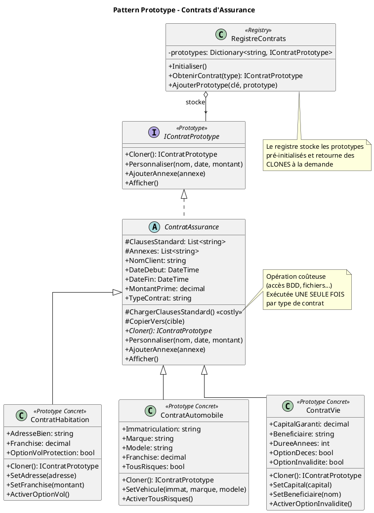

# Diagramme UML - Pattern Prototype
## Système de Génération de Contrats d'Assurance

---

## Diagramme de Classes

```
┌─────────────────────────────────────────────────────────────────────────────────────┐
│                              PATTERN PROTOTYPE                                       │
│                     Système de Génération de Contrats d'Assurance                   │
└─────────────────────────────────────────────────────────────────────────────────────┘


                              ┌────────────────────────────────┐
                              │       <<interface>>            │
                              │      IContratPrototype         │
                              ├────────────────────────────────┤
                              │ + Cloner(): IContratPrototype  │
                              │ + Personnaliser(...)           │
                              │ + AjouterAnnexe(annexe)        │
                              │ + Afficher()                   │
                              └───────────────┬────────────────┘
                                              │
                                              │ implémente
                                              ▼
                              ┌────────────────────────────────┐
                              │      ContratAssurance          │
                              │       <<abstract>>             │
                              ├────────────────────────────────┤
                              │ # ClausesStandard: List<string>│
                              │ # Annexes: List<string>        │
                              │ + NomClient: string            │
                              │ + DateDebut: DateTime          │
                              │ + DateFin: DateTime            │
                              │ + MontantPrime: decimal        │
                              │ + TypeContrat: string          │
                              ├────────────────────────────────┤
                              │ # ChargerClausesStandard()     │  ← Opération COÛTEUSE
                              │ # CopierVers(cible)            │
                              │ + abstract Cloner()            │  ← Méthode clé du pattern
                              │ + Personnaliser(...)           │
                              │ + AjouterAnnexe(annexe)        │
                              │ + virtual Afficher()           │
                              └───────────────┬────────────────┘
                                              │
                                              │ hérite
                    ┌─────────────────────────┼─────────────────────────┐
                    │                         │                         │
                    ▼                         ▼                         ▼
     ┌──────────────────────────┐ ┌──────────────────────────┐ ┌──────────────────────────┐
     │    ContratHabitation     │ │    ContratAutomobile     │ │      ContratVie          │
     │   <<prototype concret>>  │ │   <<prototype concret>>  │ │   <<prototype concret>>  │
     ├──────────────────────────┤ ├──────────────────────────┤ ├──────────────────────────┤
     │ + AdresseBien: string    │ │ + Immatriculation: string│ │ + CapitalGaranti: decimal│
     │ + Franchise: decimal     │ │ + Marque: string         │ │ + Beneficiaire: string   │
     │ + OptionVolProtection:   │ │ + Modele: string         │ │ + DureeAnnees: int       │
     │   bool                   │ │ + Franchise: decimal     │ │ + OptionDeces: bool      │
     │                          │ │ + TousRisques: bool      │ │ + OptionInvalidite: bool │
     ├──────────────────────────┤ ├──────────────────────────┤ ├──────────────────────────┤
     │ + Cloner()               │ │ + Cloner()               │ │ + Cloner()               │
     │ + SetAdresse(adresse)    │ │ + SetVehicule(...)       │ │ + SetCapital(capital)    │
     │ + SetFranchise(montant)  │ │ + ActiverTousRisques()   │ │ + SetBeneficiaire(nom)   │
     │ + ActiverOptionVol()     │ │ + Afficher()             │ │ + ActiverOptionInvalidite│
     │ + Afficher()             │ │                          │ │ + Afficher()             │
     └──────────────────────────┘ └──────────────────────────┘ └──────────────────────────┘
              │                            │                            │
              │                            │                            │
              │         ┌──────────────────┴────────────────┐           │
              │         │                                   │           │
              │         ▼                                   │           │
              │  ┌─────────────────────────────────────────────────┐    │
              │  │            RegistreContrats                     │    │
              │  │          <<Prototype Registry>>                 │    │
              │  ├─────────────────────────────────────────────────┤    │
              └──│ - prototypes: Dictionary<string,               │────┘
                 │               IContratPrototype>                │
                 ├─────────────────────────────────────────────────┤
                 │ + Initialiser()                                 │ ← Crée les 3 modèles
                 │ + ObtenirContrat(type): IContratPrototype       │ ← Retourne un CLONE
                 │ + AjouterPrototype(clé, prototype)              │ ← Ajoute variante
                 └─────────────────────────────────────────────────┘


┌─────────────────────────────────────────────────────────────────────────────────────┐
│                                    LÉGENDE                                           │
├─────────────────────────────────────────────────────────────────────────────────────┤
│   ────▶       Association / Utilisation                                             │
│   ────│▷      Héritage (extends)                                                    │
│   - - │▷      Implémentation (implements)                                           │
│   ◆────       Composition                                                           │
│   <<...>>     Stéréotype                                                            │
└─────────────────────────────────────────────────────────────────────────────────────┘
```

---

## Diagramme de Séquence - Clonage d'un Contrat

```
┌──────────┐          ┌─────────────────┐          ┌───────────────────┐
│  Client  │          │RegistreContrats│          │ContratHabitation  │
│          │          │                 │          │    (Prototype)    │
└────┬─────┘          └────────┬────────┘          └─────────┬─────────┘
     │                         │                             │
     │  ObtenirContrat         │                             │
     │  ("habitation")         │                             │
     │ ───────────────────────>│                             │
     │                         │                             │
     │                         │      Cloner()               │
     │                         │ ───────────────────────────>│
     │                         │                             │
     │                         │                             │ Crée une copie
     │                         │                             │ (SANS recharger
     │                         │                             │  les clauses)
     │                         │                             │
     │                         │      <<clone>>              │
     │                         │ <─ ─ ─ ─ ─ ─ ─ ─ ─ ─ ─ ─ ─ ─│
     │                         │                             │
     │    Contrat cloné        │                             │
     │ <───────────────────────│                             │
     │                         │                             │
     │                         │                             │
     │  Personnaliser(...)     │                             │
     │ ─────────────────────────────────────────────────────>│
     │                         │                             │
     │                         │                             │
```

---

## Comparaison : Avec vs Sans Prototype

```
SANS PROTOTYPE (Création classique)                 AVEC PROTOTYPE (Clonage)
═══════════════════════════════════                 ════════════════════════════

  Client                                              Client
    │                                                   │
    │ new ContratHabitation()                          │ registre.ObtenirContrat("habitation")
    ▼                                                   ▼
┌─────────────────────┐                           ┌─────────────────────┐
│ 1. Allouer mémoire  │                           │ 1. Trouver prototype│
├─────────────────────┤                           ├─────────────────────┤
│ 2. Charger 50       │  ⏱️ LENT                  │ 2. Cloner()         │  ⚡ RAPIDE
│    clauses depuis   │  (500ms+)                 │    (copie mémoire)  │  (<1ms)
│    BDD/fichiers     │                           │                     │
├─────────────────────┤                           ├─────────────────────┤
│ 3. Formater         │                           │ 3. Retourner copie  │
│    document         │                           │                     │
└─────────────────────┘                           └─────────────────────┘
    │                                                   │
    ▼                                                   ▼
  Contrat créé                                        Contrat cloné
  (coûteux à chaque fois)                            (quasi instantané)


  CRÉATION DE 100 CONTRATS:                         CRÉATION DE 100 CONTRATS:

  100 × 500ms = 50 secondes ❌                      1 × 500ms + 100 × 1ms = 600ms ✅
```

---

## Code PlantUML



---

## Résumé du Pattern

| Élément | Rôle | Dans notre cas |
|---------|------|----------------|
| **Prototype (interface)** | Déclare la méthode `Cloner()` | `IContratPrototype` |
| **Prototype Concret** | Implémente le clonage | `ContratHabitation`, `ContratAutomobile`, `ContratVie` |
| **Registry (optionnel)** | Stocke les prototypes pré-créés | `RegistreContrats` |
| **Client** | Demande des clones au lieu de créer | `Program.cs` |

---

## Avantages du Pattern Prototype ici

1. **Performance** : Chargement des clauses 1 seule fois par type
2. **Flexibilité** : Facile de créer des variantes (différentes franchises)
3. **Découplage** : Le client ne connaît pas les classes concrètes
4. **Extensibilité** : Ajouter un nouveau type = ajouter une classe + l'enregistrer
