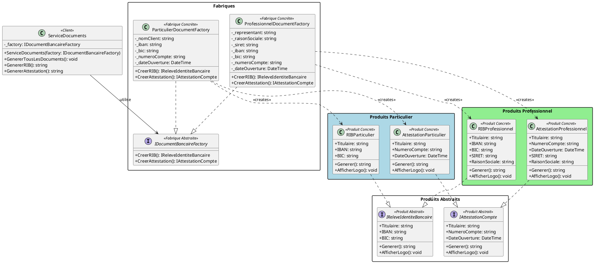

# Diagramme de Classes UML - Pattern Abstract Factory
## Système de Production de Documents Bancaires

```
┌─────────────────────────────────────────────────────────────────────────────────────────────┐
│                                    ABSTRACT FACTORY PATTERN                                  │
└─────────────────────────────────────────────────────────────────────────────────────────────┘

                              ┌─────────────────────────────────┐
                              │       ServiceDocuments          │
                              │          <<Client>>             │
                              ├─────────────────────────────────┤
                              │ - _factory: IDocumentBancaire   │
                              │             Factory             │
                              ├─────────────────────────────────┤
                              │ + GenererTousLesDocuments()     │
                              │ + GenererRIB(): string          │
                              │ + GenererAttestation(): string  │
                              └───────────────┬─────────────────┘
                                              │ utilise
                                              ▼
┌─────────────────────────────────────────────────────────────────────────────────────────────┐
│                                   FABRIQUES                                                  │
└─────────────────────────────────────────────────────────────────────────────────────────────┘

                        ┌───────────────────────────────────────┐
                        │    <<interface>>                      │
                        │  IDocumentBancaireFactory             │
                        │      (Fabrique Abstraite)             │
                        ├───────────────────────────────────────┤
                        │ + CreerRIB(): IReleveIdentiteBancaire │
                        │ + CreerAttestation(): IAttestationCpt │
                        └───────────────────┬───────────────────┘
                                            │
                       ┌────────────────────┴────────────────────┐
                       │                                         │
                       ▼                                         ▼
    ┌──────────────────────────────────┐     ┌──────────────────────────────────┐
    │   ParticulierDocumentFactory     │     │  ProfessionnelDocumentFactory    │
    │     (Fabrique Concrète 1)        │     │     (Fabrique Concrète 2)        │
    ├──────────────────────────────────┤     ├──────────────────────────────────┤
    │ - _nomClient: string             │     │ - _representant: string          │
    │ - _iban: string                  │     │ - _raisonSociale: string         │
    │ - _bic: string                   │     │ - _siret: string                 │
    │ - _numeroCompte: string          │     │ - _iban, _bic: string            │
    │ - _dateOuverture: DateTime       │     │ - _numeroCompte: string          │
    ├──────────────────────────────────┤     │ - _dateOuverture: DateTime       │
    │ + CreerRIB(): IReleveIdentite    │     ├──────────────────────────────────┤
    │              Bancaire            │     │ + CreerRIB(): IReleveIdentite    │
    │ + CreerAttestation(): IAttest    │     │              Bancaire            │
    │                     ationCompte  │     │ + CreerAttestation(): IAttest    │
    └──────────────┬───────────────────┘     │                     ationCompte  │
                   │ crée                    └──────────────┬───────────────────┘
                   │                                        │ crée
                   ▼                                        ▼

┌─────────────────────────────────────────────────────────────────────────────────────────────┐
│                                   PRODUITS                                                   │
└─────────────────────────────────────────────────────────────────────────────────────────────┘

        ┌────────────────────────────────┐          ┌────────────────────────────────┐
        │      <<interface>>             │          │      <<interface>>             │
        │  IReleveIdentiteBancaire       │          │    IAttestationCompte          │
        │    (Produit Abstrait A)        │          │    (Produit Abstrait B)        │
        ├────────────────────────────────┤          ├────────────────────────────────┤
        │ + Titulaire: string            │          │ + Titulaire: string            │
        │ + IBAN: string                 │          │ + NumeroCompte: string         │
        │ + BIC: string                  │          │ + DateOuverture: DateTime      │
        ├────────────────────────────────┤          ├────────────────────────────────┤
        │ + Generer(): string            │          │ + Generer(): string            │
        │ + AfficherLogo(): void         │          │ + AfficherLogo(): void         │
        └───────────────┬────────────────┘          └───────────────┬────────────────┘
                        │                                           │
           ┌────────────┴────────────┐                 ┌────────────┴────────────┐
           │                         │                 │                         │
           ▼                         ▼                 ▼                         ▼
┌─────────────────────┐  ┌─────────────────────┐  ┌─────────────────────┐  ┌─────────────────────┐
│   RIBParticulier    │  │  RIBProfessionnel   │  │ AttestationParticu  │  │ AttestationProfess  │
│ (Produit Concret A1)│  │(Produit Concret A2) │  │         lier        │  │        ionnel       │
├─────────────────────┤  ├─────────────────────┤  │(Produit Concret B1) │  │(Produit Concret B2) │
│ + Titulaire         │  │ + Titulaire         │  ├─────────────────────┤  ├─────────────────────┤
│ + IBAN              │  │ + IBAN              │  │ + Titulaire         │  │ + Titulaire         │
│ + BIC               │  │ + BIC               │  │ + NumeroCompte      │  │ + NumeroCompte      │
├─────────────────────┤  │ + SIRET             │  │ + DateOuverture     │  │ + DateOuverture     │
│ + Generer()         │  │ + RaisonSociale     │  ├─────────────────────┤  │ + SIRET             │
│ + AfficherLogo()    │  ├─────────────────────┤  │ + Generer()         │  │ + RaisonSociale     │
│                     │  │ + Generer()         │  │ + AfficherLogo()    │  ├─────────────────────┤
│ [Version simplifiée]│  │ + AfficherLogo()    │  │                     │  │ + Generer()         │
└─────────────────────┘  │                     │  │ [Version standard]  │  │ + AfficherLogo()    │
                         │ [Version détaillée  │  └─────────────────────┘  │                     │
                         │  avec SIRET]        │                           │ [Avec mentions      │
                         └─────────────────────┘                           │  légales]           │
                                                                           └─────────────────────┘

┌─────────────────────────────────────────────────────────────────────────────────────────────┐
│                                   LÉGENDE                                                    │
├─────────────────────────────────────────────────────────────────────────────────────────────┤
│  ─────▶  : Association / Dépendance                                                         │
│  ───────│▷ : Implémentation (implements)                                                    │
│  <<interface>> : Interface                                                                  │
│  <<Client>> : Classe cliente qui utilise le pattern                                         │
└─────────────────────────────────────────────────────────────────────────────────────────────┘


RELATIONS CRÉATIONNELLES (qui crée quoi) :
==========================================

  ParticulierDocumentFactory ──────créé────▶ RIBParticulier
                             ──────créé────▶ AttestationParticulier

  ProfessionnelDocumentFactory ────créé────▶ RIBProfessionnel
                               ────créé────▶ AttestationProfessionnel


COHÉRENCE DES FAMILLES :
========================

  ┌─ Famille PARTICULIER ─────────────────────────────────────────┐
  │  • RIBParticulier (simplifié)                                 │
  │  • AttestationParticulier (standardisée)                      │
  └───────────────────────────────────────────────────────────────┘

  ┌─ Famille PROFESSIONNEL ───────────────────────────────────────┐
  │  • RIBProfessionnel (détaillé + SIRET)                        │
  │  • AttestationProfessionnel (mentions légales spécifiques)    │
  └───────────────────────────────────────────────────────────────┘
```

## Code PlantUML (pour génération graphique)


