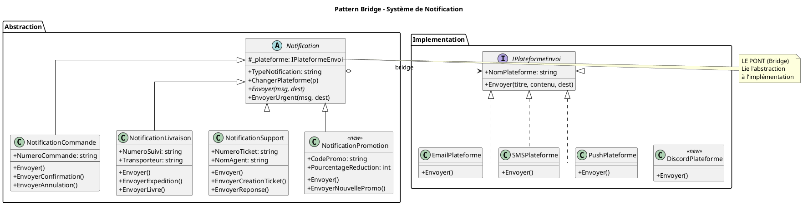

# Diagramme UML - TP3 Pattern Bridge
## Système de Notification Multi-plateforme

---

## 1. Problèmes du code existant

```
┌─────────────────────────────────────────────────────────────────────────────┐
│                    PROBLÈMES IDENTIFIÉS                                      │
├─────────────────────────────────────────────────────────────────────────────┤
│                                                                             │
│  ❌ DUPLICATION DE CODE                                                     │
│     • EnvoyerParEmail() dupliquée 3 fois (Commande, Livraison, Support)    │
│     • EnvoyerParSMS() dupliquée 3 fois                                     │
│     • EnvoyerParPush() dupliquée 3 fois                                    │
│     → 9 méthodes quasi-identiques !                                        │
│                                                                             │
│  ❌ EXTENSIBILITÉ DIFFICILE                                                 │
│     • Ajouter "Promotion" = ajouter 3 nouvelles méthodes                   │
│     • Ajouter "Discord" = modifier les 3 classes existantes                │
│     → Explosion combinatoire : n × m méthodes                              │
│                                                                             │
│  ❌ MAINTENANCE COMPLEXE                                                    │
│     • Changer le format Email = modifier 3 classes                         │
│     • Bug dans SMS = corriger à 3 endroits                                 │
│                                                                             │
│  ❌ COUPLAGE FORT                                                           │
│     • Type de notification couplé aux méthodes d'envoi                     │
│     • Impossible de changer de plateforme dynamiquement                    │
│                                                                             │
└─────────────────────────────────────────────────────────────────────────────┘
```

---

## 2. Solution : Pattern Bridge

```
┌─────────────────────────────────────────────────────────────────────────────┐
│                         PATTERN BRIDGE                                       │
│              "Séparer l'abstraction de son implémentation"                  │
└─────────────────────────────────────────────────────────────────────────────┘

    ABSTRACTION                              IMPLÉMENTATION
    (Quoi envoyer)                           (Comment envoyer)
    ══════════════                           ══════════════════

    ┌─────────────┐                          ┌─────────────┐
    │  Commande   │                          │    Email    │
    │  Livraison  │───────── PONT ──────────▶│    SMS      │
    │  Support    │                          │    Push     │
    │  Promotion  │                          │   Discord   │
    └─────────────┘                          └─────────────┘

    Les deux côtés évoluent INDÉPENDAMMENT l'un de l'autre !
```

---

## 3. Diagramme de Classes UML

```
┌─────────────────────────────────────────────────────────────────────────────────────────┐
│                              PATTERN BRIDGE - UML                                        │
└─────────────────────────────────────────────────────────────────────────────────────────┘


       ABSTRACTION                                            IMPLEMENTOR
       ═══════════                                            ════════════

┌─────────────────────────────┐                      ┌─────────────────────────────┐
│      Notification           │                      │    <<interface>>            │
│       <<abstract>>          │                      │    IPlateformeEnvoi         │
├─────────────────────────────┤                      ├─────────────────────────────┤
│ # _plateforme: IPlateformeEnvoi ──────────────────▶│ + NomPlateforme: string     │
├─────────────────────────────┤       PONT           │ + Envoyer(titre, contenu,   │
│ + TypeNotification: string  │      (Bridge)        │          destinataire)      │
│ + ChangerPlateforme(p)      │                      └──────────────┬──────────────┘
│ + abstract Envoyer(msg, dest)│                                    │
│ + virtual EnvoyerUrgent()   │                                     │ implémente
└──────────────┬──────────────┘                                     │
               │                            ┌───────────────────────┼───────────────────────┐
               │ hérite                     │                       │                       │
               │                            ▼                       ▼                       ▼
┌──────────────┼──────────────┐  ┌───────────────────┐  ┌───────────────────┐  ┌───────────────────┐
│              │              │  │  EmailPlateforme  │  │   SMSPlateforme   │  │  PushPlateforme   │
│              │              │  │ <<Concrete Impl>> │  │ <<Concrete Impl>> │  │ <<Concrete Impl>> │
▼              ▼              ▼  ├───────────────────┤  ├───────────────────┤  ├───────────────────┤
               │                 │ + NomPlateforme   │  │ + NomPlateforme   │  │ + NomPlateforme   │
               │                 │ + Envoyer()       │  │ + Envoyer()       │  │ + Envoyer()       │
               │                 │   → Format email  │  │   → Format SMS    │  │   → Format push   │
               │                 └───────────────────┘  └───────────────────┘  └───────────────────┘
               │
               │                                                    ┌───────────────────┐
               │                                                    │ DiscordPlateforme │
               │                                                    │ <<Concrete Impl>> │
               │                                                    │    (NOUVEAU)      │
               │                                                    ├───────────────────┤
               │                                                    │ + Envoyer()       │
               │                                                    └───────────────────┘
               │
┌──────────────┴────────────────────────────────────────────┐
│                                                           │
│  ┌─────────────────────────────────────────────────────┐  │
│  │                                                     │  │
▼  ▼                         ▼                           ▼  ▼
┌────────────────────┐  ┌────────────────────┐  ┌────────────────────┐  ┌────────────────────┐
│NotificationCommande│  │NotificationLivraison│ │ NotificationSupport│  │NotificationPromotion│
│ <<Refined Abstr.>> │  │ <<Refined Abstr.>> │  │ <<Refined Abstr.>> │  │  <<Refined Abstr.>>│
├────────────────────┤  ├────────────────────┤  ├────────────────────┤  │     (NOUVEAU)      │
│+ NumeroCommande    │  │+ NumeroSuivi       │  │+ NumeroTicket      │  ├────────────────────┤
├────────────────────┤  │+ Transporteur      │  │+ NomAgent          │  │+ CodePromo         │
│+ Envoyer()         │  ├────────────────────┤  ├────────────────────┤  │+ PourcentageReduc  │
│+ EnvoyerConfirm()  │  │+ Envoyer()         │  │+ Envoyer()         │  ├────────────────────┤
│+ EnvoyerAnnulation()│ │+ EnvoyerExpedition()│ │+ EnvoyerCreation() │  │+ Envoyer()         │
└────────────────────┘  │+ EnvoyerLivre()    │  │+ EnvoyerReponse()  │  │+ EnvoyerPromo()    │
                        └────────────────────┘  └────────────────────┘  └────────────────────┘


                            ┌──────────────────────────────────────┐
                            │              LÉGENDE                 │
                            ├──────────────────────────────────────┤
                            │  ─────▶   Association (le PONT)      │
                            │  ───│▷    Héritage                   │
                            │  - -│▷    Implémentation             │
                            │  <<...>>  Stéréotype                 │
                            └──────────────────────────────────────┘
```

---

## 4. Comment la solution facilite les évolutions

### 4.1 Ajouter un nouveau type de notification (ex: "Promotion")

```
AVANT (sans Bridge)                          APRÈS (avec Bridge)
════════════════════                         ════════════════════

Créer NotificationPromotion avec :           Créer UNE classe :
  • EnvoyerParEmail()                        • NotificationPromotion
  • EnvoyerParSMS()                            qui hérite de Notification
  • EnvoyerParPush()
  • EnvoyerParDiscord()                      Elle fonctionne automatiquement
  = 4 méthodes à écrire                      avec TOUTES les plateformes !

  + modifier si nouvelle plateforme          Aucune modification des
                                             plateformes existantes
```

### 4.2 Ajouter une nouvelle plateforme (ex: "Discord")

```
AVANT (sans Bridge)                          APRÈS (avec Bridge)
════════════════════                         ════════════════════

Modifier TOUTES les classes :                Créer UNE classe :
  • NotificationCommande                     • DiscordPlateforme
    + EnvoyerParDiscord()                      qui implémente IPlateformeEnvoi
  • NotificationLivraison
    + EnvoyerParDiscord()                    Elle fonctionne automatiquement
  • NotificationSupport                      avec TOUS les types de notifs !
    + EnvoyerParDiscord()
  • NotificationPromotion                    Aucune modification des
    + EnvoyerParDiscord()                    notifications existantes
  = 4 classes à modifier
```

### 4.3 Modifier le comportement d'une plateforme

```
AVANT (sans Bridge)                          APRÈS (avec Bridge)
════════════════════                         ════════════════════

Modifier la méthode dans                     Modifier UNE SEULE classe :
CHAQUE classe de notification :              • SMSPlateforme.Envoyer()
  • NotificationCommande.EnvoyerParSMS()
  • NotificationLivraison.EnvoyerParSMS()    Toutes les notifications
  • NotificationSupport.EnvoyerParSMS()      bénéficient automatiquement
  • NotificationPromotion.EnvoyerParSMS()    de la modification !
  = 4 modifications identiques
```

---

## 5. Comparaison : Nombre de classes

```
                        AVANT                    APRÈS
                        ═════                    ═════

Types de notifs         3 classes                4 classes (Abstraction)
                        (avec code dupliqué)     + classe abstraite

Plateformes             0 classes                4 classes (Implémentation)
                        (code dans chaque type)  + interface

Méthodes d'envoi        9 méthodes               4 méthodes
                        (3×3, dupliquées)        (1 par plateforme)

───────────────────────────────────────────────────────────────────────

Ajout de 1 type         +3 méthodes              +1 classe
Ajout de 1 plateforme   +4 modifications         +1 classe

TOTAL avec 4×4          16 méthodes              8 classes
                        (explosion !)            (linéaire)
```

---

## 6. Code PlantUML



---

## 7. Résumé

| Aspect | Problème initial | Solution Bridge |
|--------|------------------|-----------------|
| **Duplication** | 9 méthodes quasi-identiques | 0 duplication |
| **Extensibilité** | n × m combinaisons | n + m classes |
| **Maintenance** | Modifier partout | Modifier 1 endroit |
| **Couplage** | Fort (type ↔ envoi) | Faible (via interface) |
| **Flexibilité** | Statique | Dynamique (runtime) |
